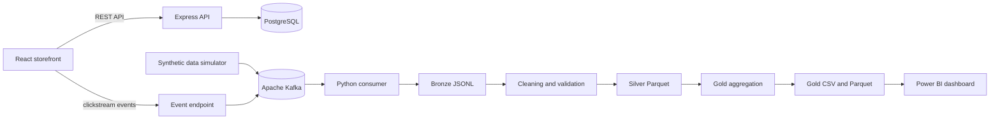

# ClickStream Commerce Analytics

An end-to-end clickstream analytics project built around a demo e-commerce store. Customer interactions are captured by a React application, validated by an Express API, published to Apache Kafka, written to a Bronze data layer, cleaned into Parquet, aggregated into Gold metrics, and visualized in Power BI.

## What this project demonstrates

- A working React storefront with product search, favorites, cart, checkout, accounts, order history, and an admin catalog.
- PostgreSQL-backed products, users, administrators, and orders.
- Browser and synthetic clickstream events published to Kafka.
- A Bronze → Silver → Gold analytics pipeline in Python.
- Funnel, conversion, abandonment, product-performance, and revenue metrics.
- A Power BI dashboard based on the Gold outputs.

## Architecture



## Technology stack

| Layer | Technology |
| --- | --- |
| Frontend | React 19, Vite, Oxlint |
| API | Node.js, Express |
| Operational database | PostgreSQL 17 |
| Event streaming | Apache Kafka, KafkaJS, Confluent Kafka Python client |
| Data processing | Python, pandas, PyArrow |
| Analytics output | JSONL, Parquet, CSV |
| Visualization | Power BI |
| Local infrastructure | Docker Compose |

## Repository structure

```text
ClickStream/
├── backend/                 Express API, database repositories, Kafka producer
├── frontend/                React storefront and browser event tracking
├── simulator/               Synthetic sessions based on live database products
├── processor/               Kafka consumer and Bronze/Silver/Gold pipeline
│   └── data/                Generated locally; ignored by Git
├── Dashboard/               Power BI report
├── docker-compose.yml       PostgreSQL, Kafka, and API services
├── requirements.txt         Python dependencies
└── .env.example             Safe local configuration template
```

## Prerequisites

- [Docker Desktop](https://www.docker.com/products/docker-desktop/)
- [Node.js 20+](https://nodejs.org/)
- [Python 3.10+](https://www.python.org/)
- Power BI Desktop, only if you want to open the included dashboard

## Quick start

### 1. Configure local environment values

Copy the environment template and replace the example admin password:

```powershell
Copy-Item .env.example .env
```

On macOS or Linux:

```bash
cp .env.example .env
```

The `.env` file is ignored by Git. Do not commit real credentials.

### 2. Start PostgreSQL, Kafka, and the API

```bash
docker compose up -d --build
```

Confirm that the API and database are ready:

```bash
curl http://localhost:3000/health
```

Expected response:

```json
{"status":"ok","database":"connected"}
```

### 3. Seed the product catalog

```bash
docker compose exec api npm run seed:products
```

The seed command is safe to rerun; it skips products that already exist.

### 4. Start the frontend

```bash
cd frontend
npm install
npm run dev
```

Open <http://localhost:5173>.

### 5. Create a Python environment

From the repository root:

```powershell
python -m venv .venv
.\.venv\Scripts\Activate.ps1
python -m pip install -r requirements.txt
```

On macOS or Linux, activate it with `source .venv/bin/activate`.

### 6. Start the analytics pipeline

Run this before generating synthetic traffic:

```bash
python processor/pipeline.py --interval 30
```

The pipeline starts the Kafka consumer and refreshes the Silver and Gold layers every 30 seconds. Stop it with `Ctrl+C`.

### 7. Generate synthetic customer sessions

In a second terminal with the Python environment active:

```bash
python simulator/event_generator.py --sessions 100 --seed 42
```

The simulator reads the current catalog from `http://localhost:3000/api/products`, so generated product events match the live database rather than a hard-coded list.

## Local services

| Service | Address | Purpose |
| --- | --- | --- |
| Frontend | `http://localhost:5173` | Storefront and admin interface |
| API | `http://localhost:3000` | Commerce and tracking API |
| PostgreSQL | `localhost:5432` | Operational data |
| Kafka | `localhost:9092` | Clickstream topic |
| Kafka topic | `clickstream-events` | Raw customer events |

## Analytics event model

Every Kafka event contains these core fields:

```json
{
  "event_id": "uuid",
  "event_type": "product_view",
  "event_timestamp": "2026-08-18T10:30:00Z",
  "user_id": "42",
  "session_id": "uuid",
  "page_url": "/product/31",
  "product_id": "31",
  "product_name": "Natural Woven Tote",
  "category": "Bags",
  "price": 92.0
}
```

Supported event types are:

- `page_view`
- `search`
- `product_view`
- `add_to_cart`
- `checkout_started`
- `payment_success`
- `payment_failed`
- `order_created`
- `user_login`

## Data layers

Generated pipeline files are stored under `processor/data/` and intentionally ignored by Git:

- **Bronze:** append-only Kafka events in `bronze/clickstream_events.jsonl`
- **Rejected:** malformed or invalid events with rejection reasons
- **Silver:** validated, normalized, and deduplicated Parquet data
- **Gold:** funnel and product-performance tables in CSV and Parquet

The included [Power BI dashboard](Dashboard/Dashboard.pbix) can be connected to the generated Gold CSV files.

## Useful commands

```bash
# View container status and logs
docker compose ps
docker compose logs -f api kafka

# Consume a finite number of Kafka records into Bronze
python processor/consumer.py --max-messages 10

# Rebuild Silver only
python processor/clean_bronze.py

# Rebuild Gold metrics
python processor/create_gold_metrics.py

# Frontend quality checks
cd frontend
npm run lint
npm run build

# Stop infrastructure
docker compose down
```

Use `docker compose down -v` only when you intentionally want to delete the local PostgreSQL and uploaded-image volumes.

## API overview

| Method and route | Description |
| --- | --- |
| `GET /health` | API and PostgreSQL health check |
| `GET /api/products` | List products |
| `GET /api/products/:id` | Get one product |
| `POST /api/products` | Create a product with an uploaded image |
| `POST /api/auth/register` | Register a customer |
| `POST /api/auth/login` | Customer login |
| `GET /api/orders?userId=:id` | Customer order history |
| `POST /api/orders` | Create an order |
| `POST /api/admin/login` | Administrator login |
| `GET /api/admin/orders` | List all orders |
| `PATCH /api/admin/orders/:id/complete` | Complete an order |
| `POST /api/events` | Validate and publish a clickstream event to Kafka |

## Configuration

| Variable | Default | Used by |
| --- | --- | --- |
| `ADMIN_NAME` | `Vantage Admin` | API |
| `ADMIN_EMAIL` | `admin@vantage.com` | API |
| `ADMIN_PASSWORD` | Required | API |
| `DATABASE_URL` | Local PostgreSQL URL | API |
| `FRONTEND_URL` | `http://localhost:5173` | API CORS |
| `KAFKA_BROKER` | `localhost:9092` | API, consumer, simulator |
| `KAFKA_TOPIC` | `clickstream-events` | API, consumer, simulator |
| `KAFKA_CONSUMER_GROUP` | `clickstream-raw-writer` | Consumer |
| `PRODUCT_API_URL` | `http://localhost:3000` | Simulator |
| `VITE_API_URL` | `http://localhost:3000` | Frontend |

## Troubleshooting

- **The API keeps restarting:** ensure `.env` exists and contains a non-empty `ADMIN_PASSWORD`.
- **The simulator cannot load products:** start the API and seed the catalog first.
- **The processor receives no events:** check that Kafka is running and that `KAFKA_BROKER` points to `localhost:9092` when Python runs on the host.
- **Parquet import errors:** activate the intended Python environment and reinstall `requirements.txt`.
- **Frontend requests fail:** confirm the API is on port 3000 and check `VITE_API_URL` if using a different address.

## Security note

This is a local analytics demonstration, not a production payment system. Checkout uses a simulated payment flow, authentication does not issue production-grade sessions or tokens, and the Docker database credentials are development defaults. Replace the authentication, secret management, network exposure, and payment implementation before any real deployment.
